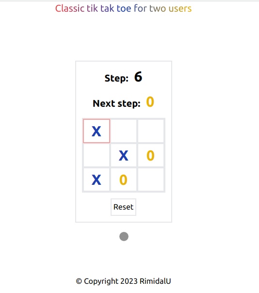

# Tik Tak Toe.

> Classic tik tak toe for two users.

---

[Description](#description) •
[Project setup](#project-setup) •
[Features](#features) •
[How To Use](#how-to-use) •
[Project Status](#project-status) •
[Room for Improvement](#room-for-improvement) •
[License](#license) •
[Contact](#contact)

## Description

SPA in React, TypeScript and Ant-Design for playing between two players in turn.

## Project setup

- Clone this repo to your desktop and run `yarn` or `npm install` to install all the dependencies.
- Once the dependencies are installed, you can run `yarn dev` or `npm dev` to start the application.
- Enjoy.

## Features

- Classic Tik Tak Toe.

## How To Use

Run [Live Demo](https://react-simple-tic-tac-toe.netlify.app/)

![tutorial][tutorial]

## Project Status

Project is: _done_

## Room for Improvement

Improvement:

- [ ] Add state manager
- [ ] Implement enemy AI

## License

This project is open source and available under the [MIT](../LICENSE).

## Contact

Created by [@RimidalU](https://www.linkedin.com/in/uladzimir-stankevich/) - feel free to contact me!

<!-- MARKDOWN LINKS & IMAGES -->

[tutorial]: ./assets/demo.webp
